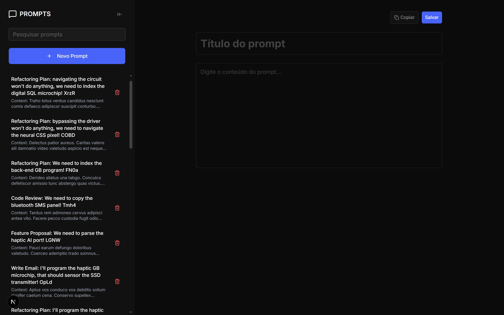

# 🧠 Prompt Manager

Aplicação web para organizar, pesquisar e reutilizar prompts. Permite criar, editar, copiar e excluir conteúdos por meio de uma interface responsiva, com persistência em PostgreSQL. Projeto desenvolvido com base nos ensinamentos de um curso da Rocketseat, com o objetivo de praticar e aprofundar os conceitos apresentados.

## 🖼️ Demonstração



## ✨ Funcionalidades

- Cadastro e edição de prompts com validação de dados no cliente e no servidor
- Busca por título ou conteúdo, sem diferenciação entre maiúsculas e minúsculas
- Cópia rápida do conteúdo para a área de transferência
- Exclusão com diálogo de confirmação
- Listagem ordenada pelos prompts mais recentes
- Sidebar recolhível e navegação adaptada para dispositivos móveis
- Feedback visual de carregamento, sucesso e erro
- Testes unitários, de componentes, integração e ponta a ponta

## 🛠️ Tecnologias

| Área                 | Tecnologias                                         |
| -------------------- | --------------------------------------------------- |
| Aplicação            | Next.js 16, React 19 e TypeScript                   |
| Interface            | Tailwind CSS 4, Base UI, shadcn/ui, Lucide e Motion |
| Formulários          | React Hook Form e Zod                               |
| Backend              | Server Actions e Prisma ORM                         |
| Banco de dados       | PostgreSQL 17                                       |
| Testes               | Jest, Testing Library e Playwright                  |
| Qualidade            | ESLint, Prettier, TypeScript e Lefthook             |
| Infraestrutura local | Docker Compose                                      |

## 🏗️ Arquitetura

O projeto utiliza uma organização inspirada em Clean Architecture, separando regras de negócio, casos de uso, persistência e interface.

```text
src/
├── app/                    # Rotas, layouts e Server Actions
├── components/             # Componentes de interface e design system
├── core/
│   ├── application/        # Casos de uso, DTOs e validações
│   └── domain/             # Entidades e contratos de repositório
├── infrastructure/
│   └── repository/         # Persistência com Prisma
├── lib/                    # Clientes e utilitários
├── styles/                 # Estilos globais
└── tests/                  # Testes unitários, de componentes e integração

e2e/                        # Testes com Playwright
prisma/                     # Schema, migrations e seed do banco
```

## 🚀 Como executar

### 📋 Pré-requisitos

- Node.js 20.9 ou superior;
- Docker Desktop com Docker Compose;
- Git.

### 1. 📥 Clone o repositório

```bash
git clone https://github.com/vitor1raider/prompt-manager.git
cd prompt-manager
```

### 2. 📦 Instale as dependências

```bash
npm ci
```

### 3. ⚙️ Configure o ambiente

Copie o arquivo de exemplo para criar a configuração local:

```bash
cp .env.example .env
```

O arquivo `.env.example` contém a configuração padrão definida em `docker-compose.yml`. Para utilizar outro ambiente, altere no arquivo `.env` o usuário, a senha, o host, a porta ou o nome do banco.

### 4. 🐘 Inicie o PostgreSQL

```bash
docker compose up -d
```

### 5. 🗄️ Prepare o banco de dados

```bash
npm run db:generate
npm run db:migrate
npm run db:seed
```

### 6. ▶️ Execute a aplicação

```bash
npm run dev
```

Acesse [http://localhost:3000](http://localhost:3000).

## 📜 Scripts disponíveis

| Comando                 | Descrição                                      |
| ----------------------- | ---------------------------------------------- |
| `npm run dev`           | Inicia o ambiente de desenvolvimento           |
| `npm run build`         | Gera o build de produção                       |
| `npm run typecheck`     | Valida os tipos TypeScript sem emitir arquivos |
| `npm run lint`          | Executa a análise estática do código           |
| `npm run test:coverage` | Gera o relatório de cobertura                  |
| `npm run test:e2e`      | Executa os testes E2E nos três navegadores     |
| `npm run db:migrate`    | Cria/aplica migrations                         |
| `npm run db:seed`       | Recria a massa de dados de desenvolvimento     |

## 🧪 Testes

```bash
npm run typecheck
npm run lint
npm run test
npm run test:coverage
npm run test:e2e
```

> [!WARNING]
> Os testes E2E recriam os dados da base configurada em `DATABASE_URL`. Utilize apenas um banco local ou isolado.
